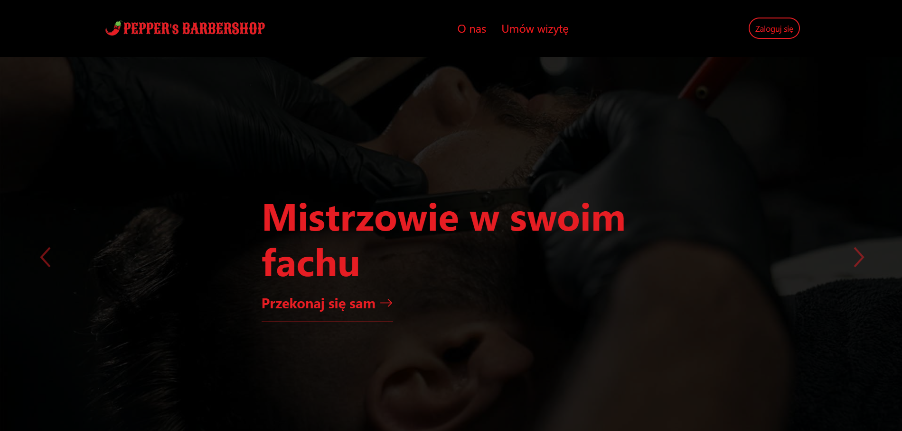
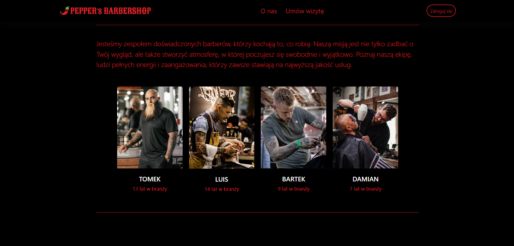
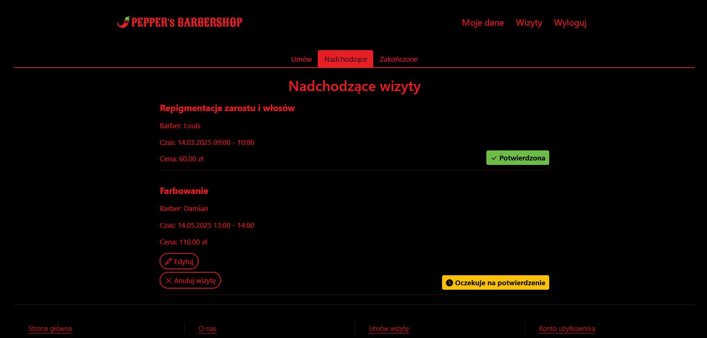
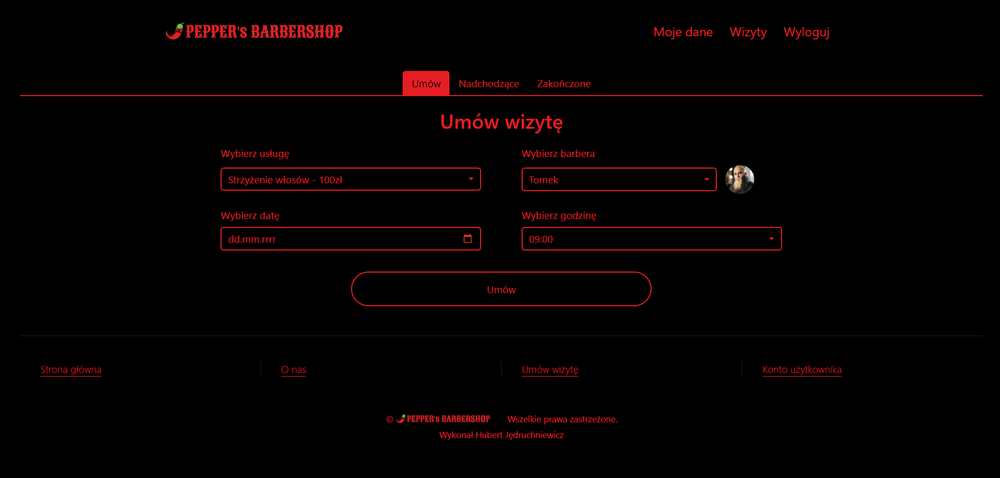
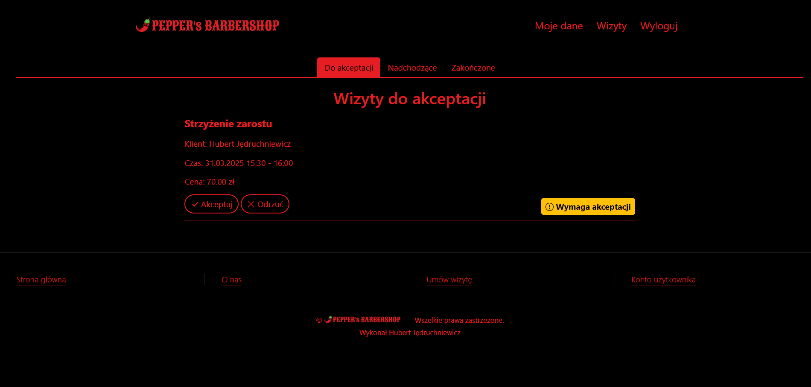
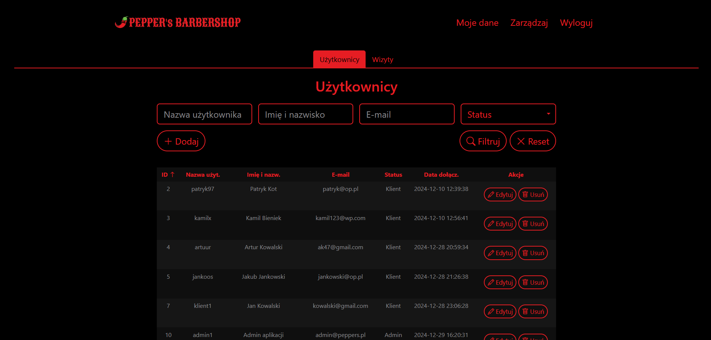
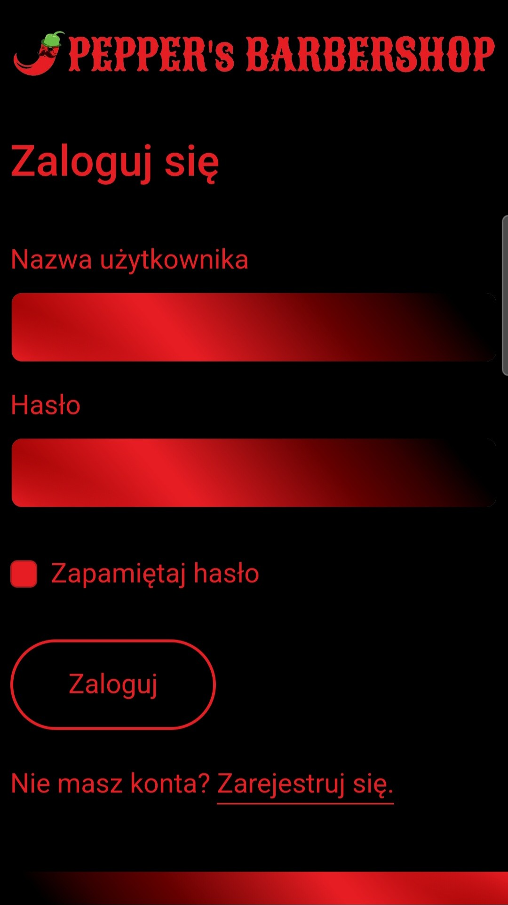
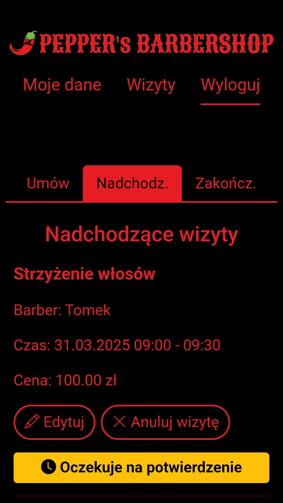

# Pepper's Barber Shop - Web Application

## Table of Contents
- 🚀 [Project Overview](#project-overview)
- ✨ [Features](#features)
- 💻 [Technologies](#technologies)
- 📋[Requirements](#requirements)
- 🛠️ [Setup Instructions](#setup-instructions)
- 👤 [Test Accounts](#test-accounts)
- 📸 [Screenshots](#screenshots)

## Project Overview
**Pepper's** is a comprehensive web application designed for modern barber shops to manage appointments, clients, and barbers efficiently. The system provides different interfaces for clients, barbers, and administrators with role-specific functionalities. **Pepper's Barbershop web application is only available in Polish language version!**

## Features

**Unauthenticated User**
- 📝 Client account registration
- 🔑 Login (Client, Barber, Administrator)

**All Authenticated Users**
- ✏️ Editing personal data
- 🗑️ Account deletion

**Client**
- 🗓️ Booking appointments (automatic updates of available time slots for selected barbers)
- ✏️ Editing appointment details*
- ❌ Canceling appointments*
- 👀 Viewing upcoming and past appointments
- ⚙️ Automatic appointment status updates ("Pending Confirmation", "Confirmed", "In Progress", "Completed", "Canceled", "Rejected by Barber")

*Available if the appointment is more than 30 minutes away

**Barber**
- 👀 Viewing appointments requiring approval, upcoming, and past appointments
- 🔍 Filtering upcoming appointments ("All", "Today", "This Week")
- ✔️ Accepting or rejecting appointments
- ❌ Canceling appointments**
- ⚙️ Automatic appointment status updates ("Pending Confirmation", "Confirmed", "In Progress", "Completed", "Canceled", "Rejected by Barber")

**Available until the appointment is completed (e.g., if the client does not show up)

**Administrator**
- 👥 Managing application users (adding, editing, deleting)***
- 📅 Managing user appointments (editing details, deleting)
- 🔍 Filtering users and appointments
- ⚙️ Sorting users and appointments

***The administrator can also add new barbers and administrators (appointment booking for newly added barbers will be automatically enabled)

**Other features**

🎨 Original, distinctive visual style
📱 Full responsiveness

## Technologies
**Backend**
- PHP
- MySQL
- Apache

**Frontend**
- Bootstrap
- HTML
- JavaScript
- AOS

## Requirements
Software versions used for development (**compatibility with earlier versions has not been tested**):
- XAMPP v3.3.0 (MySQL Database, Apache Web Server)
- PHP 8.2.12
- Bootstrap 5.0

## Setup Instructions

1. Place the project folder `peppers` in `XAMPP\htdocs`.
2. In the XAMPP control panel, start **MySQL Database** and **Apache Web Server**.
3. In your browser, go to `localhost/phpmyadmin/` and import the database `peppers_database.sql`.
4. Launch the application in your browser at: `localhost/peppers/index.php`.

## Test Accounts

**Client**
- Login: `klient1`
- Password: `klient123`

**Barber**
- Login: `barber1`
- Password: `barber1`

**Administrator**

- Login: `admin1`
- Password: `admin123`

## Screenshots

### Unauthenticated User

### Client

### Barber

### Administrator

### Mobile Device
 
